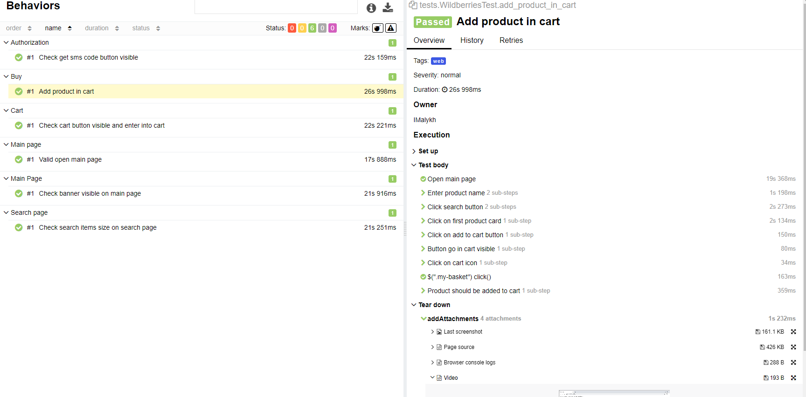
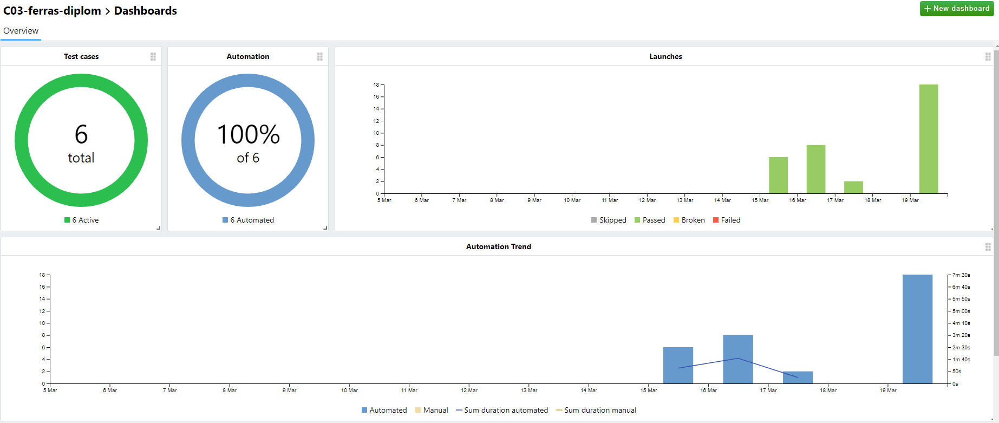
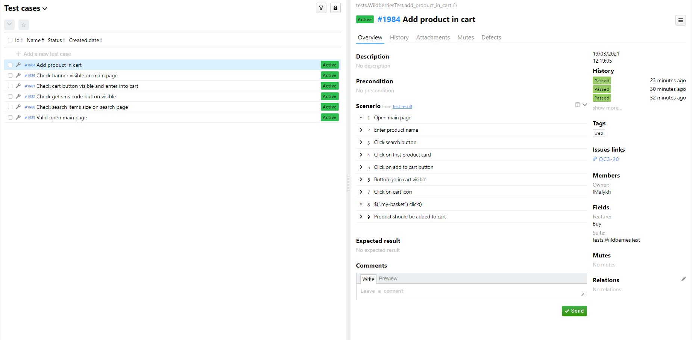
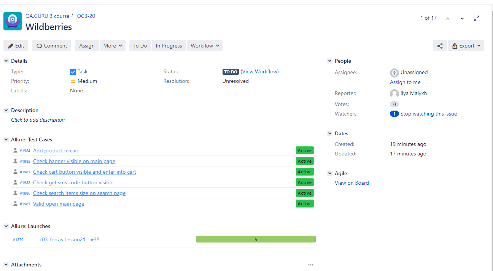
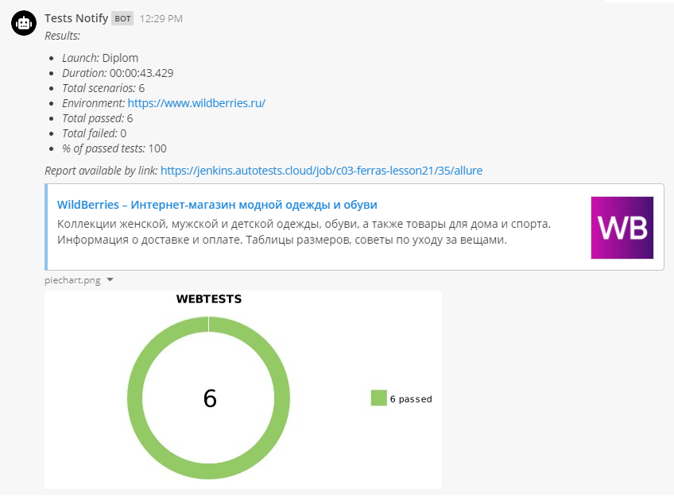
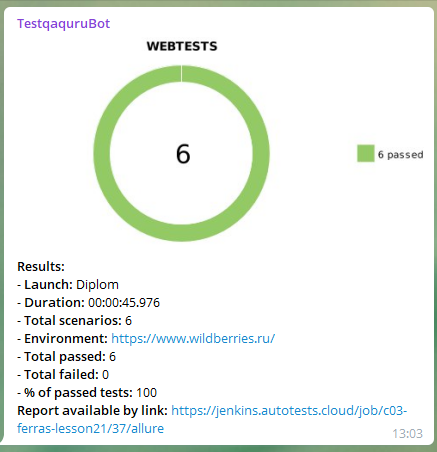

## Autotests for Wildberries.ru
### Stack
* Java 
* Gradle
* Junit5 
* Selenide 
* Allure Report
* Allure TestOps
* Selenoid
* Jenkins
    * [Ссылка на джобу](https://jenkins.autotests.cloud/job/c03-ferras-lesson21/)
* Jira
* Report
    * Telegram
    * Mattermost
___
### Selenoid

___
### Allure Report

___
### Allure TestOps

___
### Jira

___
### Mattermost notification

___
### Telegram notification

