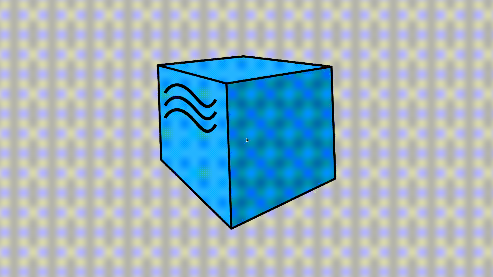
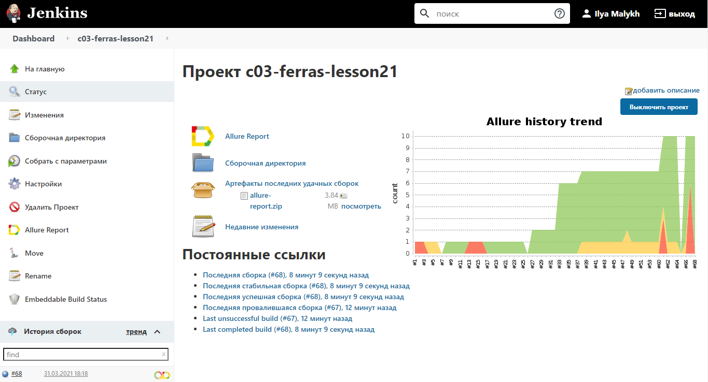
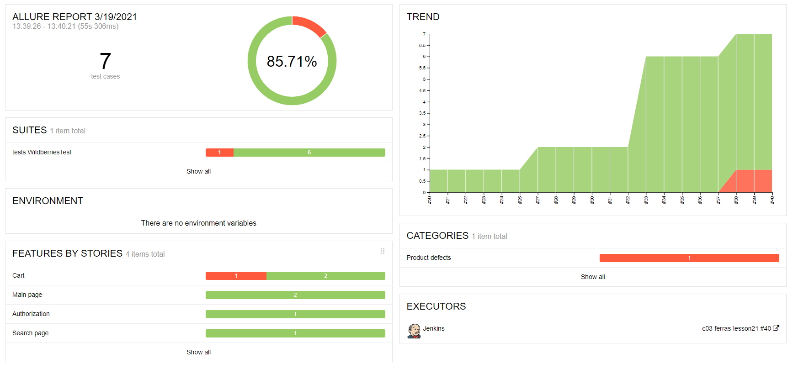
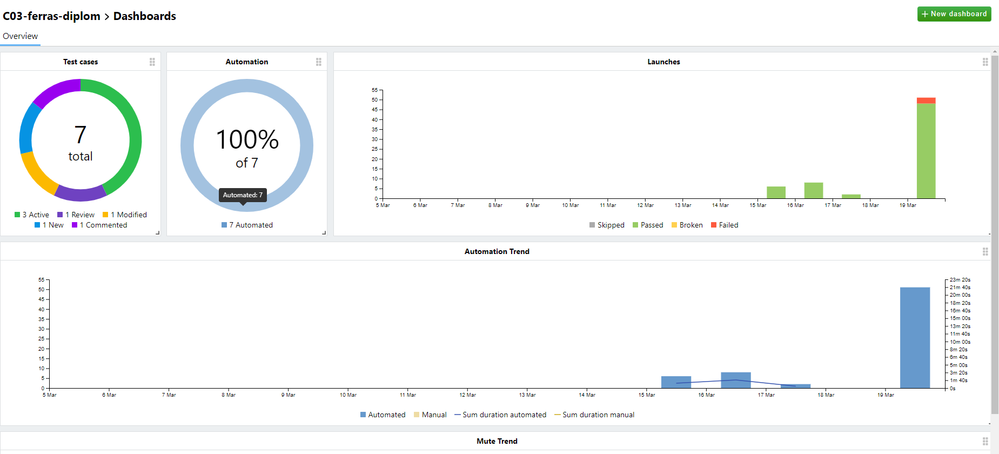
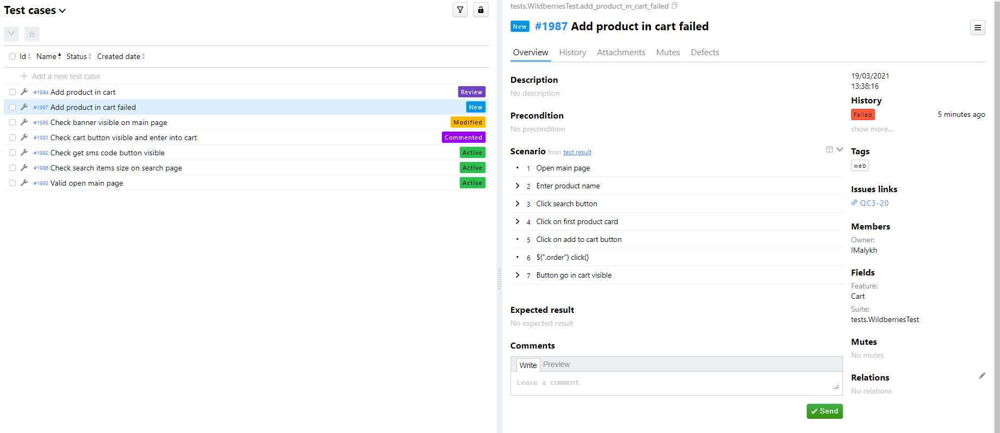
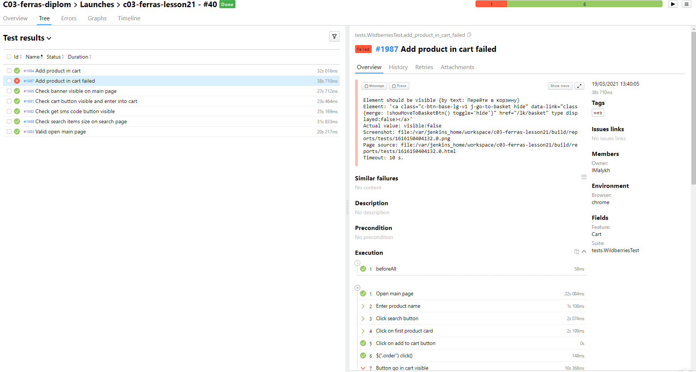
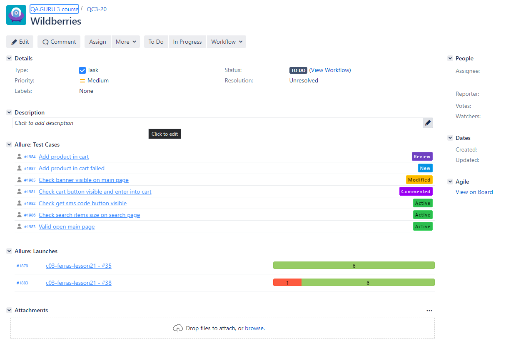
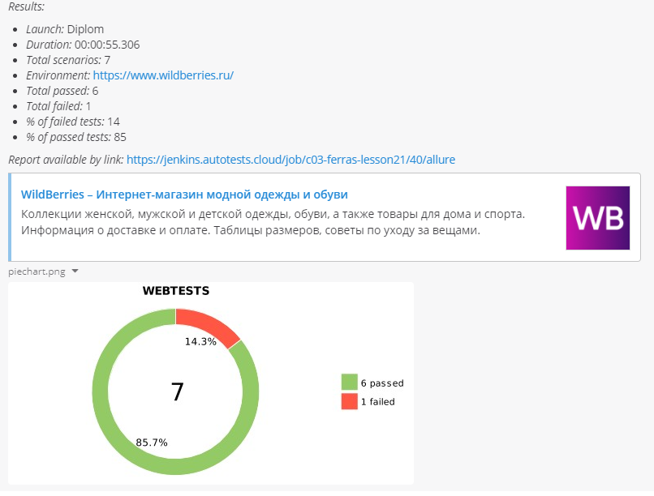
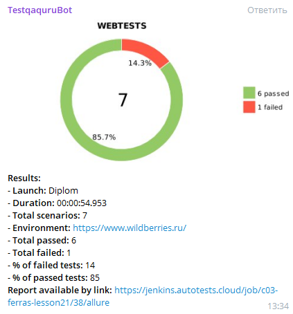

## Diploma project | QA.guru
UI tests for Wildberries.ru  
API tests for reqres.in
### Dependencies
* Java 
* Gradle
* Junit5 
* Selenide
* Rest-assured
* Lombok
### Environment
* Report
  * Allure Report
  * Allure TestOps
* CI
  * Jenkins [Ссылка на джобу](https://jenkins.autotests.cloud/job/c03-ferras-lesson21/)
* Selenoid
* TMS
  * Jira
* Notifications
    * Telegram
    * Mattermost
___
### Selenoid

___
### Jenkins Job

___
### Allure Report

___
### Allure TestOps
#### `Dashboard`

***
#### `Test cases`

***
#### `Job launch`

___
### Jira

___
### Mattermost notification
#### Contributed by me | [Pull Request](https://github.com/qa-guru/allure-notifications/pull/31)

___
### Telegram notification

